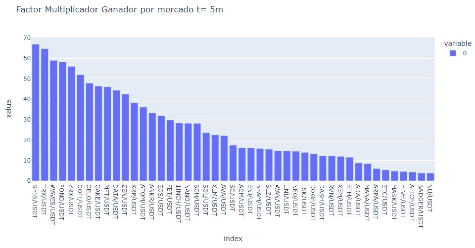
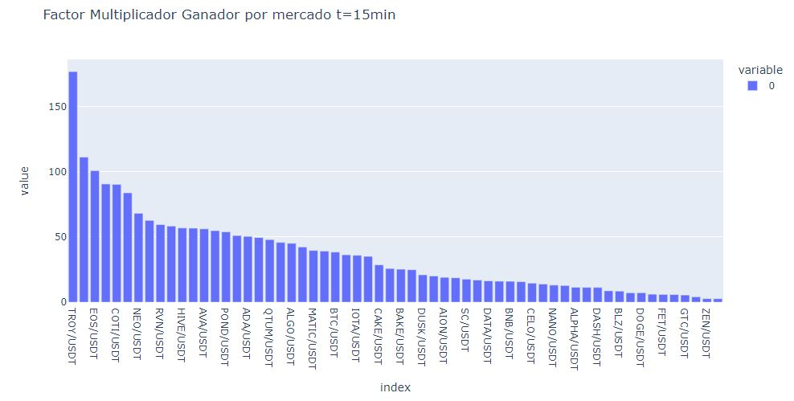
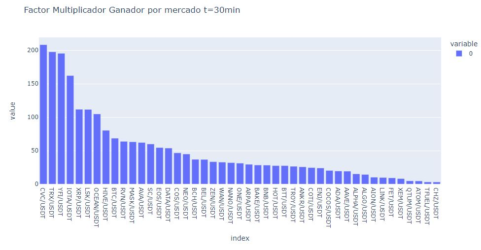

# Algoritmo Data Frame monedas por temporalidad
Notebook que lee, manipula y opera un Data Frame de 76 mercados financieros distintos y 5 temporalidades diferentes y que mediante un Algoritmo que diseñé calcula los mercados más redituables por temporalidad.

